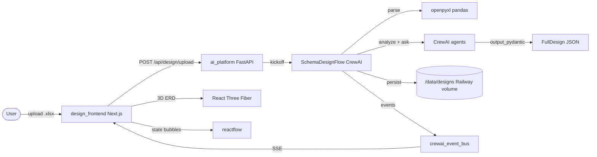

# Schema Designer Frontend Plan

## 1. Overview

A new design‑phase capability that sits **before** the existing `[ai_platform/flows/config_flow.py](ai_platform/flows/config_flow.py)`:

- **New frontend**: `ai_platform/design_frontend/` — Next.js 15 + TypeScript + Tailwind + shadcn/ui + React Three Fiber + drei + reactflow + Framer Motion + Zustand. Deployed as a **second Railway service**.
- **Reused backend**: existing `ai_platform` FastAPI app, with a **new** `/api/design` router and a new `SchemaDesignFlow` (CrewAI Flow). No changes to the existing `config_flow.py` / `ops_flow.py`.
- **Persistence**: backend‑owned. A **new Railway volume** mounts at `/data/designs` on the `ai_platform` service, storing one JSON per design.
- **Vocabulary**: reuses and extends `[ai_platform/models/config_models.py](ai_platform/models/config_models.py)` (`SchemaDesign`, `TransitionDesign`, `HandlerDesign`) so that a finished design is forward‑compatible with the existing `ConfigFlow`.

## 2. Architecture




## 3. Backend changes (in `ai_platform/`)

### 3.1 New CrewAI Flow — `ai_platform/flows/design_flow.py`

Class `SchemaDesignFlow(Flow[DesignState])` using **latest 1.14.5a6** features:

- `initial_state=DesignState` (Pydantic with `id`, `design_id`, `parsed_schema`, `business_analysis`, `clarifications`, `full_design`, `phase`, `revision_history`).
- `stream=True` so `kickoff_async` returns a `FlowStreamingOutput` we forward via SSE.
- `memory=Memory(...)` with scope `/design/{design_id}` for "remember design decisions".

Flow methods:

- `@start parse_excel` — deterministic parse via `openpyxl`/`pandas` from `ctx.input_files["schema.xlsx"]`, builds `ParsedSchema` (list of `ParsedTable` with `name`, `fields[]`, `pk`, `fks[]`). Handles multi‑sheet, merged Entity Name cells, the column layout from the screenshot (Entity Name / Field Name / Field Full Name / Field Definition / Data Type / Primary Key / Foreign Key).
- `@listen(parse_excel) analyze_business_scenarios` — single `Agent` with `output_pydantic=BusinessScenarioAnalysis` (domain guess, table groupings, critical questions).
- `@router(analyze_business_scenarios) decide_clarification` → `"need_more"` or `"ready"`.
- `@listen("need_more") emit_questions` — set `state.phase="awaiting_clarification"` and return; FE shows the questions; user answers via `/api/design/{id}/answer`, which calls `flow.kickoff` again to resume.
- `@listen("ready") generate_initial_design` — a `Crew` with three agents running sequentially, each task using `output_pydantic`:
  1. **ERDArchitectAgent** → `ERDLayout` (per‑table x/y/z coords using a force‑directed pass on the FK graph, plus cluster/color hints).
  2. **StateMachineDesignerAgent** → list of `SchemaDesign` (extends `config_models.SchemaDesign`, adding `state_descriptions: dict[str,str]`).
  3. **HandlerSuggesterAgent** → list of `HandlerSuggestion` (extends `config_models.HandlerDesign`, adding `trigger_state: str`, `target_state: str`, `fields_touched: list[str]`, `confidence: float`).
- `@listen(generate_initial_design) persist_design` — writes `/data/designs/{design_id}.json` via the storage module and emits a custom event.

Refinement entry points (called as **separate methods** on the same flow instance, mirroring how `ConfigFlow.confirm_and_generate` is invoked from FastAPI in `[ai_platform/api/routes/config.py](ai_platform/api/routes/config.py)`):

- `async refine_table(table_name, user_request)` — single agent updates one table's `SchemaDesign`.
- `async suggest_handlers_for_field(table_name, field_name, state)` — fast targeted agent, returns `list[HandlerSuggestion]`. Cached per `(table, field, state)` key.
- `async regenerate_state_machine(table_name)`.
- `async apply_user_edit(patch)` — manual user edits (drag nodes, rename field) bypass the LLM but go through validation.

### 3.2 New models — `ai_platform/models/design_models.py`

```python
from models.config_models import SchemaDesign, HandlerDesign, TransitionDesign

class ParsedField(BaseModel):
    name: str
    full_name: str
    definition: str
    data_type: str
    primary_key: bool
    foreign_key: Optional[str]  # raw "Table.Field" string

class ParsedTable(BaseModel):
    entity_name: str
    fields: list[ParsedField]
    source_sheet: str

class ParsedSchema(BaseModel):
    tables: list[ParsedTable]
    sheet_count: int

class BusinessScenarioAnalysis(BaseModel):
    domain_guess: str
    sub_domains: list[str]
    table_groupings: dict[str, list[str]]
    missing_info: bool
    questions: list[str]

class TableLayout3D(BaseModel):
    table_name: str
    x: float; y: float; z: float
    cluster_id: str
    color_hint: str

class ERDLayout(BaseModel):
    tables: list[TableLayout3D]
    edges: list[dict]  # {from_table, to_table, from_field, to_field}

class HandlerSuggestion(HandlerDesign):
    trigger_state: str
    target_state: str
    fields_touched: list[str]
    confidence: float

class FullDesign(BaseModel):
    design_id: str
    created_at: str
    parsed_schema: ParsedSchema
    business_analysis: BusinessScenarioAnalysis
    schema_designs: list[SchemaDesign]  # extends config_models.SchemaDesign
    layout: ERDLayout
    handler_suggestions: list[HandlerSuggestion]
    user_notes: str = ""

class DesignState(BaseModel):
    id: str
    design_id: str
    phase: str = "parsing"  # parsing|analyzing|awaiting_clarification|generating|ready|refining
    parsed_schema: Optional[ParsedSchema] = None
    business_analysis: Optional[BusinessScenarioAnalysis] = None
    clarifications: dict[str, str] = {}
    full_design: Optional[FullDesign] = None
    revision_history: list[dict] = []
```

### 3.3 New storage module — `ai_platform/storage/design_store.py`

File‑backed JSON store at `Path(os.environ.get("DESIGN_STORAGE_DIR", "/data/designs"))`:

- `save_design(full_design: FullDesign) -> Path`
- `load_design(design_id: str) -> FullDesign`
- `list_designs() -> list[dict]` (id, created_at, table_count, domain_guess)
- `delete_design(design_id)`
- Atomic write via `tempfile + os.replace`.

### 3.4 New API router — `ai_platform/api/routes/design.py`

Mounted at `/api/design` in `[ai_platform/app.py](ai_platform/app.py)` next to existing routers. Endpoints (all `async`, blocking CrewAI calls via `asyncio.to_thread`, matching the pattern in `[ai_platform/api/routes/config.py](ai_platform/api/routes/config.py)`):

- `POST /upload` — multipart `xlsx` upload → creates `design_id`, kicks off `parse_excel` + `analyze_business_scenarios`. Returns `{ design_id, phase, questions? }`.
- `POST /{design_id}/answer` — body `{ answers: dict[str,str] }` → resumes flow → returns updated phase.
- `GET /{design_id}` — returns full `FullDesign` JSON.
- `GET /{design_id}/events` — **SSE endpoint** consuming `crewai_event_bus` events for that flow (`method_execution_started`, `method_execution_finished`, `LLMStreamChunkEvent`, custom `design_ready`). FE consumes via `EventSource`.
- `POST /{design_id}/refine` — body `{ scope: "table"|"field"|"global", target?, request }` → routes to appropriate flow method.
- `POST /{design_id}/suggest-handlers` — body `{ table, field, state }` → cached handler suggestions.
- `POST /{design_id}/edit` — manual edits (rename, move node, add column) — no LLM.
- `GET /` — list designs.
- `DELETE /{design_id}`.

### 3.5 Glue changes

- `[ai_platform/app.py](ai_platform/app.py)`: add `from api.routes.design import router as design_router` and `app.include_router(design_router, prefix="/api/design", tags=["design"])`.
- `[ai_platform/pyproject.toml](ai_platform/pyproject.toml)`: add `openpyxl` and `pandas` (pandas is already pulled by crewai‑tools, but pin explicitly).
- `[ai_platform/entrypoint.sh](ai_platform/entrypoint.sh)`: add `mkdir -p "${DESIGN_STORAGE_DIR:-/data/designs}"`.
- `[ai_platform/Dockerfile](ai_platform/Dockerfile)`: `COPY storage/ storage/` and `COPY models/design_models.py models/` already covered by `COPY models/`.
- `[ai_platform/config.py](ai_platform/config.py)`: expose `DESIGN_STORAGE_DIR`.

## 4. Frontend (new folder `ai_platform/design_frontend/`)

Standalone Next.js 15 app, deployed independently. **Talks only to the existing `ai_platform` backend via `NEXT_PUBLIC_AI_API_URL`**.

### 4.1 Stack & deps (`package.json`)

- next@15, react@19, typescript@5
- tailwindcss, postcss, autoprefixer, class-variance-authority, clsx, tailwind-merge
- shadcn/ui primitives (Button, Dialog, Sheet, Tooltip, Tabs, ScrollArea, Toast)
- three, @react-three/fiber, @react-three/drei, @react-three/postprocessing
- reactflow (state transition bubbles)
- framer-motion
- zustand (with `persist` middleware for transient UI state)
- @tanstack/react-query (server state + caching)
- react-dropzone (xlsx upload)
- lucide-react (icons)

### 4.2 Folder structure

```
ai_platform/design_frontend/
├─ app/
│  ├─ layout.tsx                 # global shell, dark theme, font setup
│  ├─ page.tsx                   # landing: design list + upload CTA
│  ├─ design/[id]/page.tsx       # main 3D canvas page
│  └─ api/health/route.ts        # tiny health probe
├─ components/
│  ├─ scene/
│  │  ├─ Scene3D.tsx             # R3F Canvas, lighting, camera controls, postprocessing (bloom)
│  │  ├─ TableNode3D.tsx         # 3D card/sphere per table, hover halo, onClick
│  │  ├─ RelationshipEdge3D.tsx  # animated tube/curve for FK
│  │  ├─ ClusterHalo.tsx         # subtle volumetric per sub-domain
│  │  └─ MiniMap.tsx             # top-right 2D minimap
│  ├─ panels/
│  │  ├─ StateTransitionPanel.tsx # reactflow diagram (bubble nodes for states)
│  │  ├─ HandlerChipsPanel.tsx    # AI-suggested handlers per (table,field,state)
│  │  ├─ TableInspector.tsx       # right side sheet: columns table, edit
│  │  ├─ FieldInspector.tsx       # field-level edit + handler suggestions
│  │  └─ AIThinkingStream.tsx     # framer-motion list of live flow events
│  ├─ chat/
│  │  └─ DesignChat.tsx          # bottom drawer for refinement Q&A
│  ├─ upload/
│  │  └─ UploadDropzone.tsx      # xlsx dropzone with preview
│  ├─ landing/
│  │  └─ DesignList.tsx
│  └─ ui/                        # shadcn primitives (generated)
├─ lib/
│  ├─ api.ts                     # fetch client (upload, get, refine, SSE)
│  ├─ sse.ts                     # EventSource hook returning typed events
│  ├─ layout3d.ts                # client-side force-directed fallback if BE layout missing
│  └─ types.ts                   # mirrors backend Pydantic models
├─ store/
│  ├─ designStore.ts             # Zustand: current design, selected table/field, UI state
│  └─ eventsStore.ts             # rolling list of streamed flow events
├─ styles/
│  └─ globals.css                # tailwind base + custom CSS vars for theme
├─ public/                       # static assets
├─ Dockerfile                    # multi-stage Next.js standalone build
├─ next.config.mjs               # output: 'standalone', env passthrough
├─ tailwind.config.ts
├─ tsconfig.json
├─ package.json
├─ pnpm-lock.yaml (or package-lock.json)
└─ README.md
```

### 4.3 Key UX behaviors

- **Landing**: animated hero + drag‑drop xlsx; on success → navigate to `/design/[id]`.
- **Design page**:
  - Center: 3D ERD (`Scene3D`). Tables float as glowing cards, FK lines animated. Camera = `OrbitControls` + `PerspectiveCamera`. Bloom + chromatic aberration via `@react-three/postprocessing`.
  - Left: collapsible domain filter (`framer-motion`).
  - Right: contextual `Sheet` — `TableInspector` on table click, `FieldInspector` on field click; `FieldInspector` calls `/suggest-handlers` and renders `HandlerChipsPanel`.
  - Top‑right: live `AIThinkingStream` (SSE) showing each agent step + tool call as it streams in.
  - Bottom: `DesignChat` — natural‑language refinements ("merge Party and Customer", "add audit state to all transactional tables"), wired to `/refine`.
  - State transition bubble: clicking a table opens a modal with a `reactflow` diagram (states as bubbles, transitions as edges with action labels). User can drag/add/remove.
- **Iteration**: every change emits a revision entry; user can undo. Auto‑save on debounce → backend `/edit`.

### 4.4 Deployment

- `ai_platform/design_frontend/Dockerfile` — multi‑stage: `node:20-alpine` build → `node:20-alpine` runtime with Next.js `standalone` output. Expose `3000`.
- `ai_platform/design_frontend/railway.toml` — `[build] builder = "DOCKERFILE"`; env: `NEXT_PUBLIC_AI_API_URL=https://<existing-ai-platform>.up.railway.app`.
- Backend Railway service: attach a new volume mount at `/data/designs` and set `DESIGN_STORAGE_DIR=/data/designs`.

## 5. End‑to‑end happy path

1. User drags `schema.xlsx` onto landing page.
2. FE `POST /api/design/upload`; BE parses → kicks off flow → returns `{ design_id, phase: "awaiting_clarification", questions: [...] }`.
3. FE navigates to `/design/[id]`, opens SSE to `/events`, shows skeleton 3D scene + clarification modal.
4. User answers; FE `POST /answer`; BE resumes flow → emits stream events → generates `FullDesign` → persists JSON to volume → emits `design_ready`.
5. FE pulls `GET /{id}`, hydrates Zustand, animates tables flying into 3D positions.
6. User clicks a table → state bubbles open. Clicks a field → handler chips populated by `POST /suggest-handlers`.
7. User types "split Party into Person and Organization" in chat → `POST /refine` → agents update → SSE pushes diff → FE morphs scene.

## 6. Final file checklist (everything new)

### Backend (in `ai_platform/`)

- `ai_platform/flows/design_flow.py` *(new)* — `SchemaDesignFlow` with all `@start`/`@listen`/`@router` steps + refinement methods.
- `ai_platform/models/design_models.py` *(new)* — Pydantic models above.
- `ai_platform/storage/__init__.py` *(new, empty)*.
- `ai_platform/storage/design_store.py` *(new)* — file JSON store.
- `ai_platform/api/routes/design.py` *(new)* — REST + SSE router.
- `ai_platform/crews/design_crew.py` *(new)* — composes ERD / state‑machine / handler‑suggester agents into one `Crew`.
- `ai_platform/knowledge/design_patterns.md` *(new)* — domain‑agnostic ERD / state‑machine design heuristics fed to agents via `knowledge_sources`.
- `ai_platform/app.py` *(edit)* — register `design_router`.
- `ai_platform/config.py` *(edit)* — add `DESIGN_STORAGE_DIR`.
- `ai_platform/entrypoint.sh` *(edit)* — `mkdir` for design dir.
- `ai_platform/Dockerfile` *(edit)* — `COPY storage/ storage/`.
- `ai_platform/pyproject.toml` *(edit)* — add `openpyxl`, pin `pandas`.

### New frontend (`ai_platform/design_frontend/`) — all new

- `package.json`, `pnpm-lock.yaml`, `tsconfig.json`, `next.config.mjs`, `tailwind.config.ts`, `postcss.config.js`, `.gitignore`, `README.md`
- `Dockerfile`, `railway.toml`, `.env.example`
- `app/layout.tsx`, `app/page.tsx`, `app/design/[id]/page.tsx`, `app/api/health/route.ts`
- `components/scene/Scene3D.tsx`, `TableNode3D.tsx`, `RelationshipEdge3D.tsx`, `ClusterHalo.tsx`, `MiniMap.tsx`
- `components/panels/StateTransitionPanel.tsx`, `HandlerChipsPanel.tsx`, `TableInspector.tsx`, `FieldInspector.tsx`, `AIThinkingStream.tsx`
- `components/chat/DesignChat.tsx`
- `components/upload/UploadDropzone.tsx`
- `components/landing/DesignList.tsx`
- `components/ui/` — shadcn primitives generated via CLI (`button.tsx`, `dialog.tsx`, `sheet.tsx`, `tooltip.tsx`, `tabs.tsx`, `scroll-area.tsx`, `toast.tsx`)
- `lib/api.ts`, `lib/sse.ts`, `lib/layout3d.ts`, `lib/types.ts`, `lib/utils.ts`
- `store/designStore.ts`, `store/eventsStore.ts`
- `styles/globals.css`

### Railway config (operator action)

Goal: **add exactly ONE new Railway service**, keep the same `ai_platform` GitHub repo, do not split repos, do not create a new backend service.

1. **Existing backend service** (the current `ai_platform` FastAPI): just redeploy from the same branch to pick up the new `/api/design` router and supporting modules. No service settings change.
  - Optional: attach a persistent volume mount at `/data/designs` and set `DESIGN_STORAGE_DIR=/data/designs`. Without the volume, designs survive only within the container lifetime (acceptable for the V1 demo, lost on redeploy).
2. **Existing frontend service** (`ai_platform/frontend/`): not touched.
3. **NEW frontend service** (`ai_platform/design_frontend/`):
  - In Railway: New Service → Deploy from the same GitHub repo → in Settings set **Root Directory = `ai_platform/design_frontend`** so Railway only builds this subfolder.
  - Builder uses the local `Dockerfile` (the included `railway.toml` declares `[build] builder = "DOCKERFILE"`).
  - Env: `NEXT_PUBLIC_AI_API_URL=https://<existing-ai-platform>.up.railway.app`.
  - No volume required for this service (it is stateless; design state lives on the backend service).

Net Railway change: **+1 service, 0 repo splits, 0 backend redeploys beyond pulling new code.**

## 7. Out of scope (explicit)

- No changes to `[ai_platform/flows/config_flow.py](ai_platform/flows/config_flow.py)`, `[ai_platform/flows/ops_flow.py](ai_platform/flows/ops_flow.py)`, or any data‑platform handlers.
- No real DB writes or data‑platform calls from the design tool.
- No changes to the existing `[ai_platform/frontend/](ai_platform/frontend/)` SPA.
- No auth on the new frontend in this iteration (demo).

