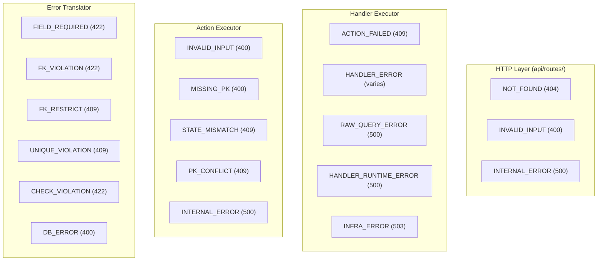
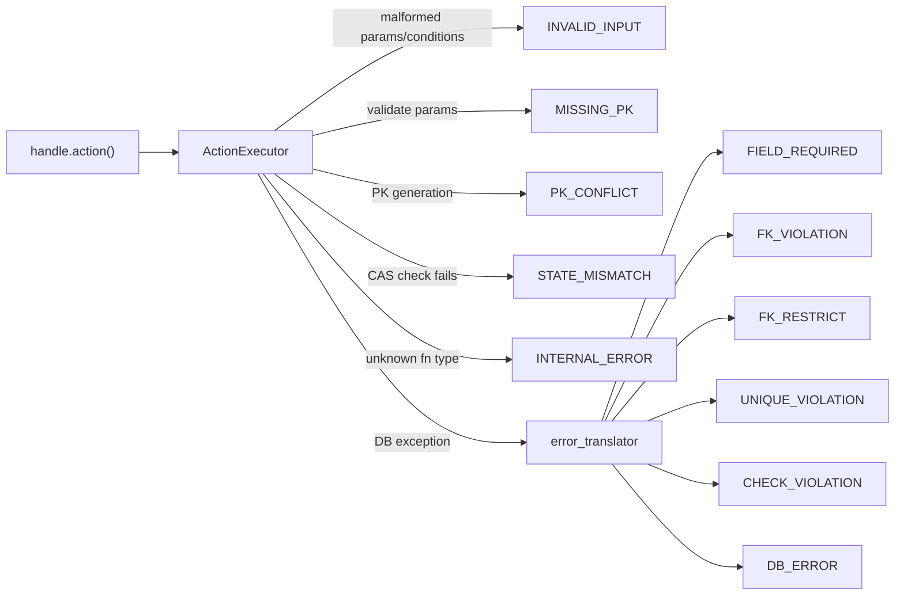
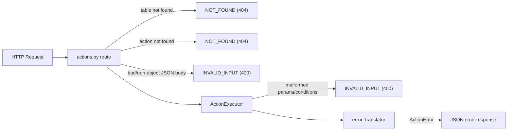
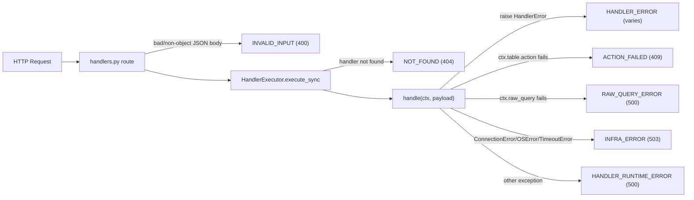
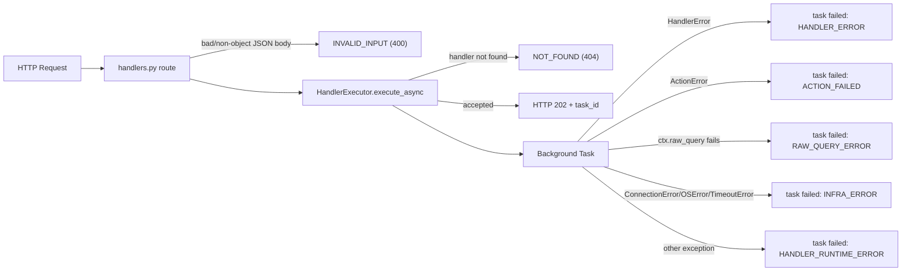
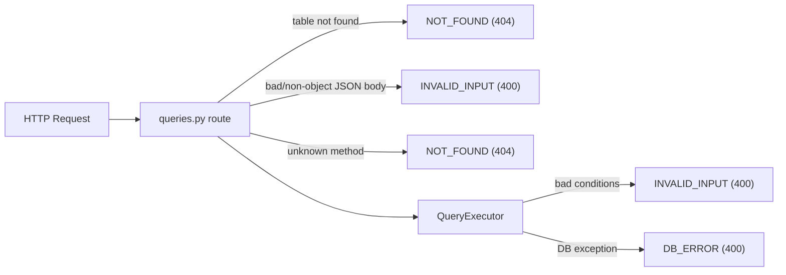
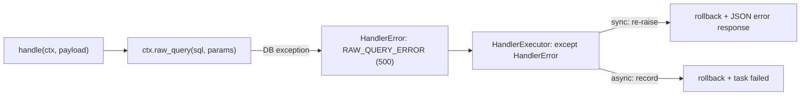

# Data Platform -- Architecture

## Table of Contents

- [System Overview](#system-overview)
- [Layer Breakdown](#layer-breakdown)
  - [Layer 1: Configuration](#layer-1-configuration-tableconfigpy-actiondefinitionpy)
  - [Layer 2: DB Backend](#layer-2-db-backend-db)
  - [Layer 3: Base Functions](#layer-3-base-functions-tablebase_functionspy)
  - [Layer 4: Action Executor](#layer-4-action-executor-actionexecutorpy)
  - [Layer 5: Query Executor](#layer-5-query-executor-queryexecutorpy)
  - [Layer 6: Table Handle](#layer-6-table-handle-tabletable_handlepy)
  - [Layer 7: Handler](#layer-7-handler-handler)
  - [Layer 8: Registry](#layer-8-registry-registrypy)
  - [Layer 9: HTTP Layer](#layer-9-http-layer-api)
- [Directory Structure](#directory-structure)
- [Data Flow](#data-flow)
  - [Action call (standalone)](#action-call-standalone)
  - [Handler call -- sync](#handler-call----sync-shared-transaction)
  - [Handler call -- async](#handler-call----async-background-execution)
- [Error Handling Architecture](#error-handling-architecture)
  - [Error Classes](#error-classes)
  - [Centralized Error Registry](#centralized-error-registry)
  - [Error Translation Pipeline](#error-translation-pipeline)
  - [Error Codes by Layer](#error-codes-by-layer)
  - [Error Codes by Execution Path](#error-codes-by-execution-path)
  - [Error Response Shapes](#error-response-shapes)
- [Implemented Fixes](#implemented-fixes)
  - [Bulk Operations Return PKs Only](#bulk-operations-return-pks-only-formerly-write-operations-return-full-row-data)
- [Production Hot Reload + Schema Catalog](#production-hot-reload--schema-catalog-formerly-issue-5)
- [What Is NOT Yet Implemented](#what-is-not-yet-implemented)
  - [1. Future DB Backends](#1-future-db-backends)
  - [2. Reload Control Plane Hardening](#2-reload-control-plane-hardening)
  - [3. Deterministic PK Generator Retry Conflict](#3-deterministic-pk-generator-retry-conflict)
- [What Is NOT Yet Improved](#what-is-not-yet-improved)
  - [1. Handler Transaction Inflexibility](#1-handler-transaction-inflexibility-single-transaction-per-handler)
  - [2. Large Transaction PostgreSQL Tuning](#2-large-transaction-postgresql-tuning)
  - [3. Redis / Kafka / Flink](#3-redis--kafka--flink--future-infrastructure-components)

---

## System Overview

Data Platform is a Python library that provides a structured, state-machine-driven data access layer on top of PostgreSQL. It eliminates raw SQL from application code and enforces data integrity through a layered architecture where every mutation flows through a controlled pipeline.

```
                          ┌───────────────────────────────────┐
                          │          HTTP Layer (FastAPI)      │
                          │  POST /api/actions/{table}/{name} │
                          │  POST /api/queries/{table}/{method}│
                          │  POST /api/handlers/{handler}     │
                          │  GET  /api/tasks/{task_id}        │
                          │  POST /api/admin/reload           │
                          │  GET  /api/admin/schema-catalog   │
                          └────────────┬──────────────────────┘
                                       │ thin wrappers only
                          ┌────────────▼──────────────────────┐
                          │         Core Library               │
                          │                                    │
                          │  ┌──────────┐   ┌──────────────┐  │
                          │  │ Handler  │──▶│   Action      │  │
                          │  │ Executor │   │   Executor    │  │
                          │  └──────────┘   └──────┬───────┘  │
                          │       │                 │          │
                          │  ┌────▼─────┐   ┌───────▼───────┐  │
                          │  │  Task    │   │ State Machine │  │
                          │  │  Store   │   │ + PK Generator│  │
                          │  └──────────┘   │ + Error Trans.│  │
                          │       │         └───────┬───────┘  │
                          │       │         ┌───────▼───────┐  │
                          │       │         │Base Functions │  │
                          │       │         │  (6 per table)│  │
                          │       │         └───────┬───────┘  │
                          │  ┌────▼─────┐   ┌───────▼───────┐  │
                          │  │  Query   │──▶│  SQL Generator│  │
                          │  │ Executor │   └───────┬───────┘  │
                          │  └──────────┘           │          │
                          └─────────────────────────┼──────────┘
                          ┌─────────────────────────▼──────────┐
                          │      DB Backend (Protocol)         │
                          │  ┌────────────────────────────┐    │
                          │  │  AsyncpgBackend (PostgreSQL)│    │
                          │  └────────────────────────────┘    │
                          └────────────────────────────────────┘
```

## Layer Breakdown

### Layer 1: Configuration (`table/config.py`, `action/definition.py`)

Everything starts with `TableConfig` -- a single Pydantic model that defines the complete truth about a table: its columns, PK strategy, states, transitions, actions, and FK relationships. A Pydantic `model_validator` enforces all constraints at definition time (e.g., insert actions must have `from_state="init"`, no duplicate action bindings).

**Files:**

- `table/config.py` -- `TableConfig`, `ColumnDef`, `FKDefinition`, `PKConfig`
- `action/definition.py` -- `ActionDef`, `StateTransition`

### Layer 2: DB Backend (`db/`)

A `DBBackend` Protocol defines the abstract interface for all database operations. The core library never imports `asyncpg` directly. The only concrete implementation is `AsyncpgBackend`.

**Files:**

- `db/backend.py` -- `DBBackend` Protocol, `Connection` Protocol
- `db/backends/asyncpg.py` -- `AsyncpgBackend` (connection pool, acquire/release, tx management)
- `db/sql.py` -- parameterized SQL generation (INSERT, UPDATE, DELETE, SELECT, WHERE with `= ANY()` for IN, `!= ALL()` for NOT IN, LIKE, ILIKE, IS NULL, IS NOT NULL, ORDER BY); condition normalization (list/tuple coercion) and validation (element count, field type, operator whitelist)
- `db/ddl.py` -- CREATE TABLE DDL generation from `TableConfig`
- `db/schema_validator.py` -- introspect existing table, compare column types/nullability/UNIQUE/CHECK/FK constraints with config, raise `SchemaConflictError`

### Layer 3: Base Functions (`table/base_functions.py`)

Six internal-only functions (`insert`, `update`, `delete`, `bulk_insert`, `bulk_update`, `bulk_delete`). They receive fully prepared data and a transaction connection, generate SQL via `db/sql.py`, and execute it. They perform no validation, no state checks, no PK generation. They are never callable by users. The three bulk functions accept an optional `returning` parameter (default `"*"`); the `ActionExecutor` passes `pk_field` for bulk operations so that only the PK column is returned from PostgreSQL instead of full rows.

### Layer 4: Action Executor (`action/executor.py`)

The pipeline that makes base functions safe and usable. For every action call:

1. Look up `ActionDef` to determine function type and state transition
2. Generate PK (for inserts) via `action/pk.py`; for custom PK strategy, retry up to `retry_on_conflict` times on UNIQUE violation (attempt INSERT, catch error, regenerate PK)
3. Inject `state = to_state` into data
4. Build CAS predicate `WHERE state = from_state` (for updates/deletes)
5. Call the bound base function
6. Catch DB constraint errors and translate via `action/error_translator.py` (including `DB_ERROR` fallback for unrecognized errors and `INTERNAL_ERROR` for unexpected failures)
7. Manage transaction (auto-commit if standalone, skip if inside handler)

**Files:**

- `action/executor.py` -- `ActionExecutor`
- `action/pk.py` -- PK generation (uuid4, sequence, custom callable)
- `action/error_translator.py` -- DB exception -> structured `ActionError`
- `table/state_machine.py` -- CAS predicate builders

### Layer 5: Query Executor (`query/executor.py`)

Four built-in read-only methods per table: `get_by_pk`, `list`, `count`, `exists`. Auto-generated on table registration. No `ActionDef` needed. Supports column selection, filtering (including `IN`, `NOT IN`, `LIKE`, `ILIKE`, `IS NULL`, `IS NOT NULL`), ordering, pagination.

### Layer 6: Table Handle (`table/table_handle.py`)

The object returned by `registry.table("orders")`. Action names become async callable methods via `__getattr__`. Built-in queries are direct methods. Can be bound to a shared transaction via `with_tx()` for use inside handlers.

### Layer 7: Handler (`handler/`)

Orchestrates multiple actions across tables in a shared transaction with custom Python logic. Convention-over-configuration: each handler is a `.py` file in a `handlers/` directory with a `MODE` variable and an `async def handle(ctx, payload)` entry point.

Two communication modes:

- **sync** (`MODE = "sync"`): blocks until completion, returns HTTP 200 with result.
- **async** (`MODE = "async"`): returns HTTP 202 immediately with a `task_id`. The handler runs in the background. Poll `GET /api/tasks/{task_id}` for status and result.

Inside handlers, all action calls are tracked via `_TrackingTableHandle`. When an action fails, the error response includes which actions completed (and were rolled back) and which step failed.

**Files:**

- `handler/executor.py` -- `HandlerExecutor`, `HandlerDef` (shared tx lifecycle, sync + async dispatch)
- `handler/context.py` -- `HandlerContext` (`ctx.{table_name}` via `__getattr__`, `raw_query()`, step tracking via `_TrackingTableHandle`)
- `handler/errors.py` -- `HandlerError`, `ActionError`
- `handler/scanner.py` -- auto-scan `handlers/` directory, import modules, discover handlers
- `handler/task_store.py` -- `TaskStore`, `TaskRecord` (in-memory task state for async handlers)

### Layer 8: Registry (`registry.py`)

Central coordinator. `register_table()` validates config, optionally creates the table via DDL, builds action executors and query executor, creates the `TableHandle`. `scan_handlers()` discovers handler files. `reload()` performs production-safe hot reload in three phases (scan, diff, execute+atomic swap), and `schema_catalog()` returns a read-only full snapshot of all registered tables/handlers.

### Layer 9: HTTP Layer (`api/`)

Thin FastAPI wrappers. Route groups mounted on the app:

- `POST /api/actions/{table}/{action}` -- calls `TableHandle.{action}(**body)` with granular HTTP status codes per error type
- `POST /api/queries/{table}/{method}` -- calls `TableHandle.{method}(**body)`
- `POST /api/handlers/{handler_name}` -- calls `HandlerExecutor.execute_sync()` or `execute_async()`
- `GET /api/tasks/{task_id}` -- polls async handler task status
- `POST /api/admin/reload` -- production hot reload with append-only safety checks and rollback isolation
- `GET /api/admin/schema-catalog` -- read-only schema catalog of all currently registered configs
- `PUT /api/admin/files/{category}/{filename}` -- write/overwrite a `.py` file in `tables/` or `handlers/`
- `GET /api/admin/files/{category}` -- list all `.py` files in `tables/` or `handlers/`
- `GET /api/admin/files/{category}/{filename}` -- read a single `.py` file's content
- `GET /api/admin/workspace/download` -- download entire workspace (tables + handlers) as a zip archive
- `GET /api/admin/api-catalog` -- list all callable action and handler APIs with full URLs (auto-adapts to local/Railway)
- `GET /api/admin/api-catalog/{table}` -- list all APIs for a specific table (actions + queries) with full URLs

**Files:**

- `api/app.py` -- app factory
- `api/routes/actions.py` -- action endpoints (with error-code-to-HTTP-status mapping)
- `api/routes/queries.py` -- query endpoints
- `api/routes/handlers.py` -- handler endpoints (200 for sync, 202 for async)
- `api/routes/tasks.py` -- task polling endpoint
- `api/routes/admin.py` -- admin endpoints (`reload`, `schema-catalog`)

## Directory Structure

```
data_platform/
  pyproject.toml
  docs/
    architecture.md
    data_platform_concepts.md
    usage.md
  lib/                               # Python package (import as `lib`)
    __init__.py                      # Public API re-exports
    errors.py                        # ErrorCode constants, HTTP_STATUS mapping
    registry.py                      # Registry class

    table/
      __init__.py
      config.py                      # TableConfig, ColumnDef, FKDefinition, PKConfig
      state_machine.py               # CAS predicate helpers
      base_functions.py              # 6 internal functions
      table_handle.py                # TableHandle proxy
      tests/
        test_config.py
        test_state_machine.py
        test_table_handle.py

    query/
      __init__.py
      executor.py                    # QueryExecutor (get_by_pk, list, count, exists)
      tests/
        test_query_executor.py

    action/
      __init__.py
      definition.py                  # ActionDef, StateTransition
      executor.py                    # ActionExecutor pipeline
      pk.py                          # PK generation strategies
      error_translator.py            # DB error -> ActionError
      tests/
        test_action_executor.py
        test_error_translator.py
        test_pk.py

    handler/
      __init__.py
      executor.py                    # HandlerExecutor + HandlerDef
      context.py                     # HandlerContext (ctx.table_name, raw_query, step tracking)
      errors.py                      # HandlerError, ActionError
      scanner.py                     # Auto-scan handlers/ directory
      task_store.py                  # TaskStore + TaskRecord for async handlers
      tests/
        test_handler.py
        test_scanner.py
        test_task_store.py

    db/
      __init__.py
      backend.py                     # DBBackend Protocol
      sql.py                         # SQL generation (IN -> = ANY, NOT IN -> != ALL)
      ddl.py                         # DDL generation
      schema_validator.py            # Schema introspection + full diff (types, UNIQUE, CHECK, FK)
      backends/
        __init__.py
        asyncpg.py                   # AsyncpgBackend
      tests/
        test_ddl.py
        test_sql.py
        test_schema_validator.py

    reload/
      __init__.py
      scanner.py                     # scan_tables + scan_handlers_safe (per-file isolation)
      diff.py                        # append-only rule checks (T2-T10)
      tests/
        test_scanner.py
        test_diff.py

    api/
      __init__.py
      app.py                         # FastAPI app factory
      routes/
        __init__.py
        actions.py                   # Action endpoints
        queries.py                   # Query endpoints
        handlers.py                  # Handler endpoints (sync 200 / async 202)
        tasks.py                     # Task polling endpoint
        admin.py                     # Admin endpoints (reload, schema-catalog)
      tests/
        test_api.py
        test_admin_routes.py

  tests/                             # Cross-module and integration tests
    conftest.py                      # Pytest fixtures (imports from tests.helpers)
    test_registry.py
    test_registry_reload.py
    helpers/                         # Shared test utilities (plain Python modules)
      __init__.py
      mock_backend.py                # MockBackend -- in-memory DBBackend for tests
      sample_configs.py              # Reusable TableConfig factories (orders, items)
```

## Data Flow

### Action call (standalone)

```
User code: await orders.create_order(data={...})
  │
  ▼
TableHandle.__getattr__("create_order")
  │  returns async callable
  ▼
ActionExecutor.execute(params, tx=None)
  │  tx=None -> acquire conn, BEGIN
  ▼
ActionExecutor._execute_inner
  │  1. generate PK (uuid4)
  │  2. inject state="draft" into data
  │  3. call base_functions.insert(backend, table, prepared_data, tx)
  │     └─> sql.build_insert() -> "INSERT INTO ... RETURNING *"
  │         └─> backend.execute_one(conn, sql, params)
  │  4. on success: COMMIT, release conn
  │  5. on DB error: translate_db_error() -> ActionError, ROLLBACK
  ▼
{"success": true, "data": {...inserted row...}}
```

### Handler call -- sync (shared transaction)

```
HTTP: POST /api/handlers/create_full_order {payload}
  │
  ▼
HandlerExecutor.execute_sync("create_full_order", payload)
  │  acquire conn, BEGIN
  ▼
HandlerContext created (tx=conn, table_handles)
  │
  ▼
handler.handle(ctx, payload)
  │  ctx.orders -> _TrackingTableHandle(orders.with_tx(shared_conn))
  │  await ctx.orders.create_order(data={...})
  │    └─> ActionExecutor.execute(params, tx=shared_conn)
  │         (no auto-commit, step recorded)
  │  await ctx.inventory.deduct_stock(...)
  │    └─> same shared tx, step recorded
  ▼
All succeed: COMMIT, return {"success": true, "data": handler_return}
Any fail:   ROLLBACK, return {"success": false, "error": {..., completed_actions, failed_action}}
```

### Handler call -- async (background execution)

```
HTTP: POST /api/handlers/bulk_migrate {payload}
  │
  ▼
HandlerExecutor.execute_async("bulk_migrate", payload)
  │  create TaskRecord(status=pending)
  │  launch asyncio.create_task(...)
  │  return immediately
  ▼
HTTP 202: {"success": true, "task_id": "T-123", "status": "accepted"}

Background:
  │  mark task running
  │  acquire conn, BEGIN, execute handler logic
  │  on success: COMMIT, mark task completed
  │  on failure: ROLLBACK, mark task failed

Poll:
  GET /api/tasks/T-123
  ▼
  {"task_id": "T-123", "status": "completed", "result": {...}}
  or
  {"task_id": "T-123", "status": "failed", "error": {...}}
```

---

## Error Handling Architecture

### Error Classes

Two exception types carry all error information through the system:

- `**ActionError**` (`handler/errors.py`) -- raised by ActionExecutor, PK generator, and error translator. Carries `code`, `message`, `details`, `table`, `action`, `step`.
- `**HandlerError**` (`handler/errors.py`) -- raised by HandlerExecutor or handler authors. Carries `code`, `message`, `detail`, `http_status`.

### Centralized Error Registry

All error codes and HTTP status mappings are defined in `lib/errors.py`:

- `**ErrorCode**` -- namespace class with string constants for every error code.
- `**HTTP_STATUS**` -- `dict[str, int]` mapping error codes to HTTP status codes.

Every module that raises errors imports from `lib/errors` instead of using string literals.

### Error Translation Pipeline

DB constraint exceptions are translated by `action/error_translator.py` using a three-tier extraction strategy:

1. **asyncpg structured attributes** -- `exc.column_name`, `exc.table_name`, `exc.constraint_name`, `exc.detail` (preferred, most accurate)
2. **DETAIL string regex** -- parse `Key (col)=(val) is not present in table "tbl"` patterns from the `detail` attribute
3. **Message substring fallback** -- search the main error message for keywords like `column`, `table`, `constraint` (for non-asyncpg backends)

### Error Codes by Layer




### Error Codes by Execution Path

The following diagrams show which error codes can appear at each layer for the six execution paths.

#### Path 1: Action -- Function Call (standalone)

`await handle.create_order(data={...})` -- called from Python code, no HTTP layer.




All errors are raised as `ActionError`.

#### Path 2: Action -- HTTP

`POST /api/actions/{table}/{action}` -- called via HTTP.




The HTTP layer validates JSON/body structure, catches `ActionError`, and maps `error.code` to an HTTP status via `HTTP_STATUS`. Malformed params/conditions are normalized to `ActionError(code=INVALID_INPUT)` in the action path.

#### Path 3: Handler -- Sync

`POST /api/handlers/{name}` with `MODE="sync"`.




When an `ActionError` bubbles up from an action inside the handler, `HandlerExecutor` wraps it as `HandlerError` with `code=ACTION_FAILED`, including `detail.failed_action` (table, action, step, original error code) and `detail.completed_actions` (rolled-back steps).

Handler results are serialized to JSON-safe types via `_make_json_safe()` **before** the transaction is committed. This prevents the commit-then-serialize race condition where a successful commit could be followed by a serialization failure, producing a misleading error response for an operation that actually succeeded.

#### Path 4: Handler -- Async

`POST /api/handlers/{name}` with `MODE="async"`.




The HTTP response is always 202 (accepted). Errors are recorded in the task store and retrieved via `GET /api/tasks/{task_id}`. Results are serialized via `_make_json_safe()` before commit, same as the sync path.

#### Path 5: Query Actions (list, get_by_pk, count, exists)

`POST /api/queries/{table}/{method}`.




Query actions are read-only. `ValueError` from condition validation becomes `INVALID_INPUT`; non-object JSON bodies also return `INVALID_INPUT`. Any other DB exception becomes `DB_ERROR`.

#### Path 6: Raw Query (inside handlers)

`ctx.raw_query(sql, params)` -- available only inside handler functions.




Raw query errors are not translated through `error_translator` because they are arbitrary SQL. `HandlerContext.raw_query()` catches all exceptions and wraps them as `HandlerError` with `code=RAW_QUERY_ERROR`, which flows through the existing `except HandlerError` handler in the executor.

### Error Response Shapes

**Action error (direct or via HTTP):**

```json
{
    "success": false,
    "error": {
        "code": "FK_VIOLATION",
        "message": "referenced row does not exist in 'party_type_list' for type",
        "details": {"field": "type", "referenced_table": "party_type_list"}
    }
}
```

**Handler error (sync HTTP):**

```json
{
    "success": false,
    "error": {
        "code": "ACTION_FAILED",
        "message": "Action 'orders.create_order' failed: ...",
        "detail": {
            "failed_action": {"table": "orders", "action": "create_order", "step": 1, "error_code": "FK_VIOLATION", "error_detail": "..."},
            "completed_actions": [{"table": "...", "action": "...", "step": 0, "status": "rolled_back"}]
        }
    }
}
```

**Async handler task failure (via GET /api/tasks/{id}):**

```json
{
    "task_id": "T-123",
    "status": "failed",
    "error": {
        "code": "ACTION_FAILED",
        "message": "Action 'orders.create_order' failed: ...",
        "detail": { "failed_action": {...}, "completed_actions": [...] }
    }
}
```

---

## Implemented Fixes

### c

Hot reload is now implemented with a three-phase safety pipeline:

1. **Scan phase**: `scan_tables()` and `scan_handlers_safe()` import files one-by-one with isolated `try/except`, so syntax/import errors are collected into `scan_errors` and do not break the running service.
2. **Diff phase**: existing table configs are checked with append-only rules (`T2`-`T10`). Any unsafe mutation (delete/modify existing definition) returns `409` and cancels the entire reload.
3. **Execute phase**: new/updated table handles are built in staging dicts, then atomically swapped into live registry maps. If execution fails, in-memory registry state is preserved and best-effort DB cleanup is attempted for newly created tables.

Admin endpoints:

- `POST /api/admin/reload` -- trigger hot reload (scan, diff, execute)
- `GET /api/admin/schema-catalog` -- read-only snapshot of all registered configs
- `PUT /api/admin/files/{category}/{filename}` -- write a `.py` file to `tables/` or `handlers/`
- `GET /api/admin/files/{category}` -- list `.py` files in a category
- `GET /api/admin/files/{category}/{filename}` -- read a file's content
- `GET /api/admin/workspace/download` -- download all workspace files as zip

The file management endpoints enable external systems (e.g., CrewAI) to push new table configs and handler definitions at runtime via HTTP, then trigger hot reload -- without restarting the service or requiring filesystem access.

Key implementation files:

- `lib/reload/scanner.py`
- `lib/reload/diff.py`
- `lib/registry.py` (`ReloadResult`, `_build_handle()`, `reload()`, `schema_catalog()`)
- `lib/api/routes/admin.py` (reload, schema-catalog, file management, workspace download)
- `workspace/crm_demo/app.py` (mounts admin routes, startup volume scan)

Automated coverage for this feature:

- `lib/reload/tests/test_scanner.py`
- `lib/reload/tests/test_diff.py`
- `tests/test_registry_reload.py`
- `lib/api/tests/test_admin_routes.py`

### Bulk Operations Return PKs Only (formerly "Write Operations Return Full Row Data")

All 6 SQL write functions previously used `RETURNING *`. For single-row operations (`insert`, `update`, `delete`) this is correct -- the client needs server-generated PK and state. For bulk operations (`bulk_insert`, `bulk_update`, `bulk_delete`) it created a pressure chain: PG network transfer of all rows, Python dict allocation, `_make_json_safe` traversal, JSON serialization, and HTTP response -- all proportional to rows x columns.

Industry consensus (MongoDB `insertMany`, DynamoDB `ReturnValues`, Supabase `Prefer: return=minimal`, Elasticsearch Bulk API): bulk writes should return IDs + count, not full rows.

**What changed:**

- `lib/db/sql.py`: `build_bulk_insert`, `build_bulk_update`, `build_bulk_delete` accept a `returning` parameter (default `"*"`).
- `lib/table/base_functions.py`: `bulk_insert`, `bulk_update`, `bulk_delete` pass `returning` through.
- `lib/action/executor.py`: `_do_bulk_insert`, `_do_bulk_update`, `_do_bulk_delete` pass `returning=pk_field` and return `{"count": N, "pks": [...]}` instead of `{"rows": [...], "count": N}`.

Single-row operations are unchanged -- they still use `RETURNING *` and return the full row dict.

**Handler pattern for full data after bulk insert:**

If a handler needs full row data after a bulk operation, it can query explicitly:

```python
result = await ctx.order_lines.bulk_create_lines(rows=prepared)
pks = result["data"]["pks"]

full_rows = await ctx.order_lines.list(
    conditions=[("line_id", "IN", pks)],
    limit=len(pks),
)
```

This makes the data transfer cost visible to the handler author rather than paying it silently on every bulk call.

### Finer Error Taxonomy (formerly issue #3)

The broad `INTERNAL_ERROR` catch-all has been split into three operationally specific error codes in the handler layer:


| Error Code              | HTTP Status | Trigger                                                                           |
| ----------------------- | ----------- | --------------------------------------------------------------------------------- |
| `RAW_QUERY_ERROR`       | 500         | `ctx.raw_query(...)` fails (arbitrary SQL execution error)                        |
| `INFRA_ERROR`           | 503         | `ConnectionError`, `OSError`, or `TimeoutError` (backend/driver/network failures) |
| `HANDLER_RUNTIME_ERROR` | 500         | Any other unexpected exception inside handler logic                               |


`INTERNAL_ERROR` is now reserved for truly unknown/unmapped errors only (e.g., failures outside the handler flow itself).

**Implementation:**

- `lib/errors.py` -- new `ErrorCode` constants and `HTTP_STATUS` mappings
- `lib/handler/context.py` -- `raw_query()` catches exceptions and raises `HandlerError(code=RAW_QUERY_ERROR)`
- `lib/handler/executor.py` -- `except Exception` split into `except _INFRA_EXCEPTIONS` and `except Exception` with distinct error codes, in both `execute_sync` and `_run_async_handler`

### Serialize-Before-Commit (formerly issue #4)

The commit-then-serialize race condition has been fixed. Handler results are now converted to JSON-safe types **before** the transaction is committed:

```
result = await handler_def.handle_fn(ctx, payload)
safe_result = _make_json_safe(result)    # ← serialize BEFORE commit
await self._backend.commit(conn)          # ← commit only after serialization succeeds
return {"success": True, "data": safe_result}
```

If `_make_json_safe()` raises `TypeError` (e.g., handler returns an object that cannot be converted), the transaction is rolled back and an error is returned. This eliminates the ambiguity where a committed transaction could produce a failure response.

**Types handled by `_make_json_safe()`:**


| Python type                                           | Conversion            |
| ----------------------------------------------------- | --------------------- |
| `datetime.date`, `datetime.datetime`, `datetime.time` | `.isoformat()`        |
| `uuid.UUID`                                           | `str()`               |
| `decimal.Decimal`                                     | `float()`             |
| `dict`, `list`, `tuple`                               | Recursively converted |


Handler authors no longer need manual `_serialize()` helpers for return values.

### Table-Level CHECK Constraints (formerly issue #3)

`TableConfig` now supports a `table_constraints: list[str] = []` field for multi-column CHECK constraints that cannot be expressed as a single-column `ColumnDef.check`. For example:

```python
TableConfig(
    ...,
    table_constraints=["listed_ind = false OR market_id IS NOT NULL"],
)
```

`ddl.py`'s `generate_create_table` appends these as `CHECK (expr)` lines after FK definitions.

`schema_validator.py` validates table-level constraint counts bidirectionally (config vs DB). The internal `_get_check_columns` was replaced with `_get_check_info` which separates column-level (single-column) from table-level (multi-column) CHECK constraints, preventing false positive diffs where table-level constraint columns would be misidentified as missing column-level checks.

**Implementation:**

- `lib/table/config.py` -- `table_constraints: list[str] = []` field on `TableConfig`
- `lib/db/ddl.py` -- appends `CHECK (expr)` for each table constraint after FK definitions
- `lib/db/schema_validator.py` -- `_get_check_info()` returns `(column_check_cols, table_check_count)`; `validate_schema()` compares table-level counts

### Schema Validator: Bidirectional CHECK (formerly issue #4, bug fix)

`schema_validator.py` now checks CHECK constraints in both directions, matching the behavior of all other constraint types (columns, UNIQUE, FK):

- Config has CHECK but DB does not → diff (existing)
- DB has CHECK but config does not → diff (new)

The fix uses the column-level set from `_get_check_info()` (which excludes columns referenced only by table-level constraints) so that table-level constraint columns do not trigger false column-level diffs.

**Implementation:**

- `lib/db/schema_validator.py` -- added `elif not col.check and col.name in db_check_cols` branch inside the column loop

---

## What Is NOT Yet Implemented

The following features are defined in the plan but are **not implemented** in the current codebase:

### 1. Future DB Backends

**Plan says:** The `DBBackend` Protocol enables future backends (MySQL, SQLAlchemy, etc.).

**Current state:** Only `AsyncpgBackend` exists. The SQL generator (`db/sql.py`) uses PostgreSQL-specific syntax (`$1, $2` placeholders, `RETURNING `*, `= ANY()` for IN). Supporting a different database would require a dialect-aware SQL generator.

### 2. Reload Control Plane Hardening

Hot reload is functionally implemented, but three production-grade control-plane safeguards are still pending.

#### 2.1 SQL Identifier Safety for Rollback DDL

**Current state:** rollback cleanup in `Registry.reload()` uses a formatted SQL string:

```python
f"DROP TABLE IF EXISTS {tbl}"
```

This currently relies on `TableConfig` naming discipline and works for normal cases, but it is not a hardened identifier strategy. It does not provide centralized quoting/validation semantics for reserved words, case-sensitive identifiers, or future non-config-driven rollback paths.

**Not yet implemented:**

- A single identifier utility (for example `lib/db/identifiers.py`) that:
  - validates legal identifier format,
  - applies PostgreSQL-safe quoting (`"identifier"`),
  - rejects invalid identifiers before SQL execution.
- Refactoring rollback cleanup and DDL generation call sites to use this utility instead of ad-hoc string interpolation.
- Dedicated tests proving rollback SQL remains safe and syntactically valid for edge-case names.

#### 2.2 Concurrent Reload Guard

**Current state:** multiple `POST /api/admin/reload` requests can be triggered concurrently. Because reload contains await points (scan/import, DB DDL, execution), two operations can overlap in time.

**Not yet implemented:**

- A registry-level reload mutex (for example `asyncio.Lock`) that guarantees at most one reload operation is active at a time.
- Deterministic API behavior for contention:
  - reject immediately with a clear code (e.g., `RELOAD_IN_PROGRESS`),
  - or queue with timeout policy (explicitly defined).
- Request correlation fields in the response (`reload_id`, `started_at`) so operators can trace collisions and retries.
- Concurrency tests that launch simultaneous reload calls and verify no interleaving state mutations.

#### 2.3 Reload Audit Log Schema

**Current state:** reload returns rich API responses but there is no stable, structured audit event schema for compliance/operations.

**Not yet implemented:**

- A versioned reload audit schema with required fields, for example:
  - `event_type`, `schema_version`, `reload_id`,
  - `trigger_source`, `triggered_by`, `request_id`,
  - `started_at`, `finished_at`, `duration_ms`,
  - `status` (`success`, `rejected`, `failed`),
  - `tables_added`, `tables_updated`, `handlers_added`, `handlers_skipped`,
  - `scan_errors_count`, `rejections_count`, `error_message`,
  - `rollback_tables_created`, `rollback_drop_attempted`, `rollback_drop_failed`.
- A guaranteed write path for these events (JSON log sink and/or DB table) with retention policy.
- Tests/assertions that every reload path emits exactly one terminal audit event with consistent field completeness.

### 3. Deterministic PK Generator Retry Conflict

**Problem:** `ActionExecutor._do_insert` (`lib/action/executor.py`) retries PK generation up to `retry_on_conflict` times (default 3) on UNIQUE violation. This works correctly for generators with a random component (e.g., `party` uses `random.randint`), but fails for deterministic generators like `party_type_list` (`generator=lambda data: data["type"]`).

When a deterministic generator produces a duplicate PK:

1. Attempt 1: INSERT fails with UNIQUE VIOLATION, PostgreSQL marks the transaction as **aborted**
2. Attempt 2: generator returns the same PK (data unchanged), INSERT runs but PostgreSQL rejects it with `"current transaction is aborted, commands ignored until end of transaction block"`
3. This error is not a UNIQUE VIOLATION, so `_is_unique_violation()` returns False, the exception is re-raised to `error_translator`, and the client receives `DB_ERROR` instead of `UNIQUE_VIOLATION`

**Expected behavior:** The client should receive `UNIQUE_VIOLATION` (409) with field details. The retry mechanism masks the original error.

**Proposed fix:** Before retrying, check if the newly generated PK is identical to the previous attempt. If so, skip the retry and let the original UNIQUE VIOLATION propagate. Alternatively, detect deterministic generators at registration time and set `retry_on_conflict=1` automatically.

**Files involved:** `lib/action/executor.py` (`_do_insert` retry loop), `lib/table/config.py` (`PKConfig.retry_on_conflict`).

---

## What Is NOT Yet Improved

The following are known design limitations in the current codebase that work correctly but have performance, scalability, or flexibility issues at scale.

### 1. Handler Transaction Inflexibility (Single Transaction per Handler)

**Problem:** `HandlerExecutor.execute_sync` (`lib/handler/executor.py:61-114`) wraps the entire handler in a single transaction — one `BEGIN` before calling `handle_fn`, one `COMMIT` after it returns. All actions within the handler share this transaction.

This is the correct design for business transactions (e.g., `create_party` handler: INSERT party + INSERT party_corp must be atomic). But it becomes a limitation for batch/import handlers:

- A handler that inserts 60,000 rows across two tables holds row locks on all rows for the full 30-second duration
- If the handler fails at row 59,999, all 59,999 previously successful rows are rolled back
- One database connection is occupied for the entire duration, reducing pool availability

**Proposed improvement:** Add a new handler mode `MODE = "sync_manual"` where `HandlerExecutor` does not auto-manage BEGIN/COMMIT. Instead, the handler author controls transaction boundaries via `ctx.begin()` context manager:

```python
MODE = "sync_manual"

async def handle(ctx, payload):
    for batch in chunks(payload["rows"], 1000):
        async with ctx.begin() as tx:
            await tx.table_a.bulk_insert(rows=batch_a)
            await tx.table_b.bulk_insert(rows=batch_b)
        # each 1000-row batch is committed independently
```

This is an append-only change: existing `MODE = "sync"` and `MODE = "async"` behavior stays exactly the same. The new mode shifts transaction responsibility from the framework to the handler author, trading automatic atomicity for flexibility and performance on batch workloads.

**Files involved:** `lib/handler/executor.py` (new `execute_sync_manual` method), `lib/handler/context.py` (new `begin()` context manager), `lib/handler/scanner.py` (accept `"sync_manual"` as valid MODE).

### 2. Large Transaction PostgreSQL Tuning

A handler performing bulk operations (e.g., 60,000 reads + 60,000 writes across two tables in one transaction) places heavy pressure on PostgreSQL — WAL writes, row locks held for the full transaction, fsync at COMMIT, and autovacuum after. Python-side pressure is minimal (the CPU only constructs SQL and decodes results; 99% of the time is spent in `await`). The connection pool has moderate pressure (one connection occupied for the full duration).

Key PG parameters to tune: `max_wal_size` (prevent frequent checkpoints), `statement_timeout` (allow long bulk SQL), `work_mem` (memory for sorts in large queries), `checkpoint_timeout`, and autovacuum thresholds. For Supabase-hosted PG, most server-level parameters are managed by the platform and require instance upgrade if insufficient.

Full analysis with specific parameter values, examples, and the multi-transaction handler design discussion: `[keyi_log/2026-03-28-concurrency-pressure-and-pg-tuning.md](../../keyi_log/2026-03-28-concurrency-pressure-and-pg-tuning.md)`

### 3. Redis / Kafka / Flink — Future Infrastructure Components

The current system uses PostgreSQL as the sole data store with no caching, message queue, or stream processing layer. This is sufficient for the current CRM scale but has known gaps: `TaskStore` is in-memory and lost on restart (`lib/handler/task_store.py`), lookup tables are re-queried from PG on every request, and there is no event notification to downstream systems.

**Redis** (first to introduce): TaskStore persistence across workers, lookup table caching, distributed locks for cross-row/cross-table business constraints that CAS cannot cover. **Kafka** (when 2+ downstream systems need data change events): audit trail, system decoupling via event-driven architecture, CDC, async task queues decoupled from API process. **Flink** (furthest out): real-time aggregation dashboards, complex event processing, real-time ETL pipelines.

Full analysis with architecture diagrams, combination scenarios, CAS vs distributed lock examples, and introduction timeline: `[keyi_log/2026-03-28-redis-kafka-flink-when-and-why.md](../../keyi_log/2026-03-28-redis-kafka-flink-when-and-why.md)`